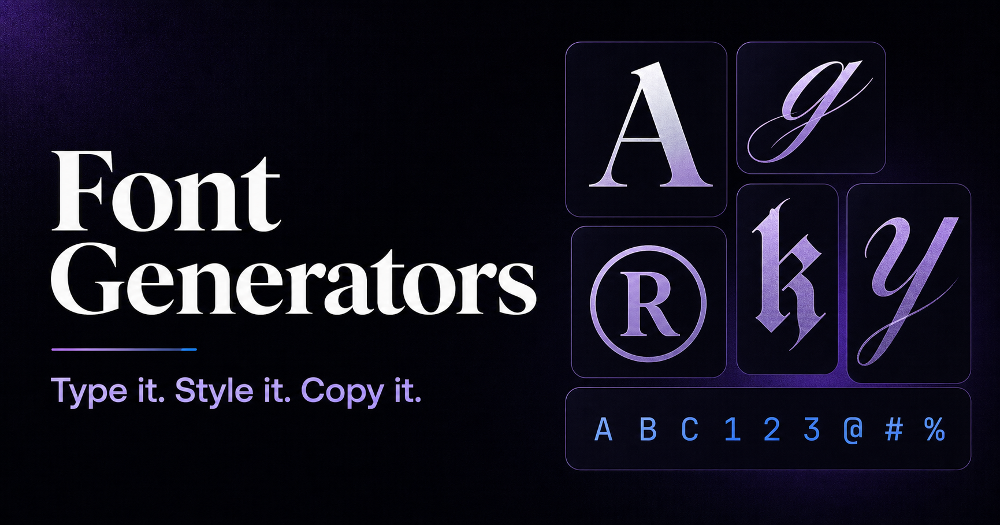

# Font Generators

[font-generators.org](https://font-generators.org/) is a collection of browser-based tools for creating copy-and-paste Unicode text, ASCII banners, font previews, meme captions, game text, and downloadable title artwork.



The project distinguishes between text and artwork instead of presenting every result as a “font”:

- **Unicode generators** substitute ordinary characters with compatible Unicode symbols that can be copied as plain text.
- **ASCII generators** arrange text into multi-line banners and can export TXT, PNG, or SVG files.
- **Font preview tools** render installed or bundled typefaces and label their source and availability.
- **Visual generators** create themed graphics, memes, and game-inspired titles for PNG or SVG download.
- **Hybrid generators** provide both rendered artwork and a separately labelled copyable-text alternative.

User-entered text and image composition are processed in the browser. The application has no account system, database, or text-generation API.

## Features

- Real-time Unicode conversion with search, category filters, and one-click copy
- 53 Unicode transformations, including bold, italic, script, fraktur, enclosed, fullwidth, small caps, superscript, effects, and decorative frames
- 45 style-generator pages and 6 fandom-generator pages backed by a shared registry
- PNG and SVG artwork export with colors, outlines, shadows, gradients, backgrounds, and page-specific presets
- Multi-line ASCII banners with copy, TXT, PNG, and SVG output
- Minecraft text codes, bitmap rendering, material effects, and block-logo output
- Device-font availability checks and clearly labelled bundled open-source alternatives
- Grapheme-aware text handling so emoji and combined characters are not split unnecessarily
- Responsive layouts, dark mode, social previews, FAQs, related content, and 8 practical guides
- Generated `sitemap.xml`, `robots.txt`, `llms.txt`, canonical URLs, Open Graph metadata, and structured data

## How Unicode Conversion Works

Copyable styles are characters, not downloadable font files. The generator maps supported Latin letters and digits to characters from Unicode blocks such as Mathematical Alphanumeric Symbols, Enclosed Alphanumerics, and Letterlike Symbols. Combining marks are used for effects such as underline and strikethrough.

Unsupported characters are preserved rather than removed. Rendering still depends on the destination app, operating system, and available fonts, so some styles may appear differently or display as missing-glyph boxes. Decorative Unicode can also be difficult for screen readers; it is best used for short, non-essential text.

Rendered artwork behaves differently: the browser draws the selected typeface and effects to a canvas or SVG. PNG preserves that rendering, while an editable SVG that references a device font may require the same font on the device where it is opened.

## Tech Stack

| Area | Technology |
| --- | --- |
| Framework | [Next.js](https://nextjs.org/) 16 with the App Router |
| UI | [React](https://react.dev/) 19 and TypeScript |
| Styling | [Tailwind CSS](https://tailwindcss.com/) 3 and Typography |
| Animation | [Motion](https://motion.dev/) / Framer Motion |
| Fonts | Self-hosted `@fontsource` packages plus labelled system-font stacks |
| Quality | ESLint 9 with Next.js Core Web Vitals and TypeScript rules |

## Getting Started

### Prerequisites

- Node.js 20.9 or newer
- npm

### Installation

```bash
git clone <repository-url>
cd font_generator
npm ci
cp .env.local.example .env.local
npm run dev
```

Open [http://localhost:3000](http://localhost:3000). Changes under `app`, `components`, and `lib` are reflected by the development server.

The environment file is optional for local development. If you do not need a custom Google Analytics property, you can skip the copy step.

## Available Scripts

| Command | Description |
| --- | --- |
| `npm run dev` | Start the development server with webpack |
| `npm run build` | Create an optimized production build with webpack |
| `npm run start` | Serve the production build |
| `npm run lint` | Run the Next.js ESLint configuration |

Run a production build locally with:

```bash
npm run build
npm run start
```

## Environment Variables

| Variable | Required | Description |
| --- | --- | --- |
| `NEXT_PUBLIC_GA_ID` | No | Overrides the GA4 measurement ID used on the production site |

Variables prefixed with `NEXT_PUBLIC_` are embedded in the browser bundle. Do not place secrets in them. Google Analytics is loaded only when the browser hostname is `font-generators.org` or `www.font-generators.org`, so local and preview traffic is not reported. The site also loads Google AdSense on eligible content routes; update those integrations when adapting the project for another deployment or production domain.

## Project Structure

```text
app/
├── layout.tsx                 # Global metadata, navigation, analytics, and ads
├── page.tsx                   # Main searchable Unicode generator
├── styles/                    # Style directory and dynamic generator routes
├── fandom/                    # Fandom directory and dynamic generator routes
├── guides/                    # Guide index and dynamic article routes
├── about/                     # About page
├── contact/                   # Contact page
├── privacy/                   # Privacy policy
├── terms/                     # Terms of use
├── llms.txt/route.ts          # Static machine-readable site directory
├── robots.ts                  # Generated robots.txt
├── sitemap.ts                 # Generated XML sitemap
└── globals.css                # Global styles and design tokens

components/
├── GeneratorTool.tsx          # Unicode conversion, filtering, previews, and copy
├── AsciiGeneratorTool.tsx     # ASCII banner rendering and export
├── VisualGeneratorTool.tsx    # Canvas/SVG artwork editor and export
├── MinecraftGeneratorTool.tsx # Game text and block-logo modes
├── PageTemplate.tsx           # Shared generator-page composition
├── GuideTemplate.tsx          # Shared guide-page composition
├── StyleDirectory.tsx         # Filterable generator listing
├── Header.tsx                 # Responsive site navigation
└── Footer.tsx                 # Footer navigation and site links

lib/
├── unicode.ts                 # Unicode maps and grapheme-safe utilities
├── generator.ts               # Unicode style definitions and page configs
├── ascii-font.ts              # ASCII glyph data and layout logic
├── pixel-font.ts              # Bitmap glyph data and measurements
├── visual-generator.ts        # Visual presets, capabilities, and font metadata
├── generator-registry.ts      # Canonical generator definitions and validation
├── generator-collections.ts   # Homepage and directory groupings
├── data.ts                    # Core page content, examples, and FAQs
├── new-keyword-pages.ts       # Additional style and fandom page content
├── additional-guides.ts       # Additional guide articles
├── guide-metadata.ts          # Guide navigation metadata
└── page-supplements.ts        # Page-specific content supplements

public/
├── ads.txt                    # Authorized digital seller declaration
└── og-font-generators.png     # Default social sharing image
```

## Content and Generator Architecture

Dynamic routes are generated from typed data rather than one file per generator:

1. Page copy, examples, FAQs, relationships, and default Unicode styles live in `lib/data.ts` or `lib/new-keyword-pages.ts`.
2. `lib/generator-registry.ts` assigns each page a generator kind, capabilities, expected outputs, and acceptance criteria.
3. Unicode transformations are defined in `lib/generator.ts`; visual tools use configurations from `lib/visual-generator.ts`.
4. `components/PageTemplate.tsx` selects the correct interactive tool for the registered generator kind.

When adding a page, keep its slug, category, canonical path, default style IDs, related links, and generator configuration aligned. The registry performs duplicate-ID, duplicate-path, output, acceptance-criteria, and unknown-style checks when it is loaded.

## Routes

| Route | Purpose |
| --- | --- |
| `/` | Main Unicode text generator |
| `/styles` | Browse Unicode, ASCII, font-preview, meme, and artwork tools |
| `/styles/[slug]` | Individual style generator |
| `/fandom` | Browse unofficial themed and game-related tools |
| `/fandom/[slug]` | Individual fandom generator |
| `/guides` | Browse compatibility, accessibility, and usage guides |
| `/guides/[slug]` | Individual guide |
| `/sitemap.xml` | Search-engine URL inventory |
| `/robots.txt` | Crawler rules |
| `/llms.txt` | Plain-text inventory of generators, outputs, and guides |

## Deployment

The repository uses the standard Next.js production runtime and can be deployed to Vercel or another Node.js platform that supports Next.js 16. Use `npm run build` during deployment and `npm run start` for a self-hosted Node.js process.

No `output: 'export'` setting is currently enabled, so do not treat the `.next` directory as a standalone static-site bundle. If you add static export later, verify dynamic routes, metadata routes, image handling, analytics, and advertising behavior against that deployment mode.

Before publishing a fork, review the production domain in metadata, canonical URLs, sitemap, robots rules, analytics, AdSense client ID, `public/ads.txt`, contact information, privacy policy, and terms.

## Privacy and Compatibility Notes

- Text transformation, previews, uploads, and artwork export run locally in the browser.
- Analytics and advertising scripts make their own network requests when enabled; consult the privacy policy and configure consent requirements for the deployment region.
- Fandom and brand-inspired tools are unofficial and do not distribute official logos or proprietary font files.
- System-font previews vary by device. Bundled alternatives are identified with their source and license in the UI.
- Unicode availability and platform naming rules vary, so important usernames and bios should be tested in their final destination.

## License

This repository does not currently include a standalone license file. Add an appropriate `LICENSE` before redistributing the project or accepting external contributions.
